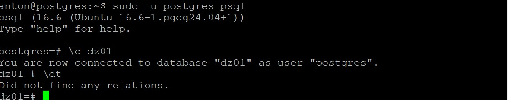
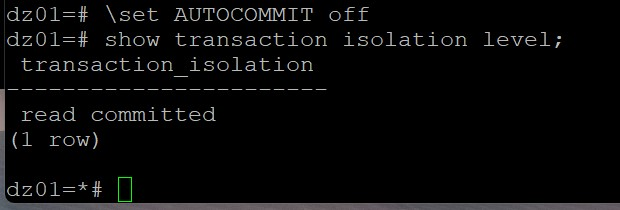
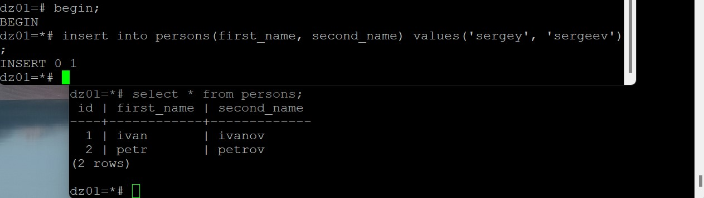
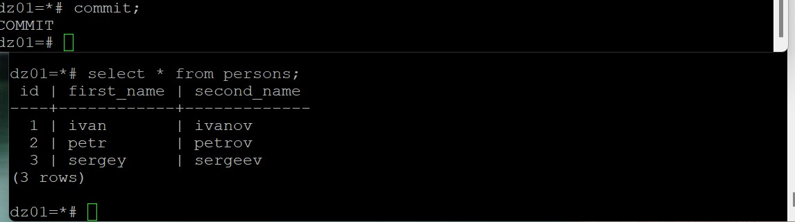
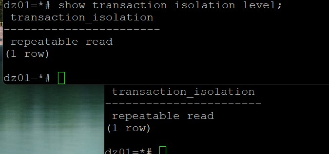
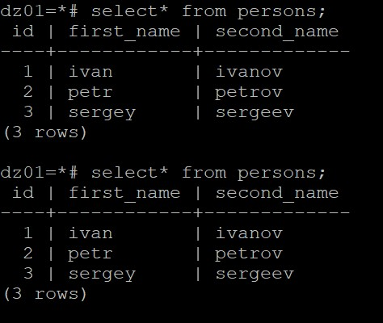
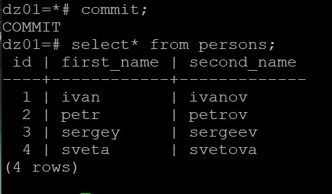

| ** Лабораторная работа №1 по курсу "PostgreSQL для администраторов баз данных и разработчиков" "Работа с уровнями изоляции транзакции в PostgreSQL" **|
|---|

 

## Задание:
### Работа с уровнями изоляции транзакции в PostgreSQL

 

## Решение:

### 0. Установка СУБД
 * Установил PostgreSQL v16

### 1. Работа с уровнем изоляции транзакций read committed
 * Подключился двумя терминалами к хосту с СУБД
 * Создал отдельную базу данных

 
 
 * В БД создал таблицу persons, вставил в нее две записи
 * Посмотрел текущий уровень изоляции транзакций, выставлен в read committed

 

 * В обоих сессия отключил autocommit 
 * В первом терминале открыл транзакцию и вставил еще строку в таблицу persons, транзакцию не фиксировал
 * Во втором терминале сделал выборку из таблицы persons, ожидаемо получил две строки. Строку добавленную в первой сессии (третья по счету) не увидел, т.к. транзакция в первой сессии еще не зафиксирована, а уровень изоляции транзакций читает строки только зафиксированных транзакций
 
 
 
  В первом терминале зафиксировал транзакцию
 * Во втором терминале повторил выборку из таблицы persons, ожидаемо увидел три строки (т.к. транзакция, создавшая третью строку, была зафиксирована)
 
 
 
 * Завершил транзакцию во второй сессии

### 2. Работа с уровнем изоляции транзакций repeatable read
 * Начал новые транзакции в обоих терминалах, выставил уровень изоляции транзакций в repeatable read

 * В первой сессии добавил строку в таблицу persons, транзакцию не фиксировал
 * Во второй сессии сделал выборку из таблицы persons, ожидаемо вижу три строки (строки, добавленной в первой сессии, не вижу), т.к. транзакция не была зафиксирована
 * Завершил транзакцию в первой сессии и повторил выборку из таблицы. Как и ожидалось вижу только три строки, т.к. уровень изоляции транзакций repeatable read отображает данные, которые попали в снимок данных транзакции в момент выполнения первого оператора после открытия транзакции
 
 
 
 * Зафиксировал транзакцию во второй сессии и повторил выборку из таблицы persons, увидел все четыре строки, т.к. был создан новый снимок данных для выборки
 
 
